# Brain Healer — FPGA Sequence Memory Game

**50.002 Computation Structures · Team 13**

A fast-paced, single-player memory challenge built on the Alchitry Au FPGA. Players must recall and reproduce increasingly complex sequences of directional arrows under time pressure to achieve the highest score possible.

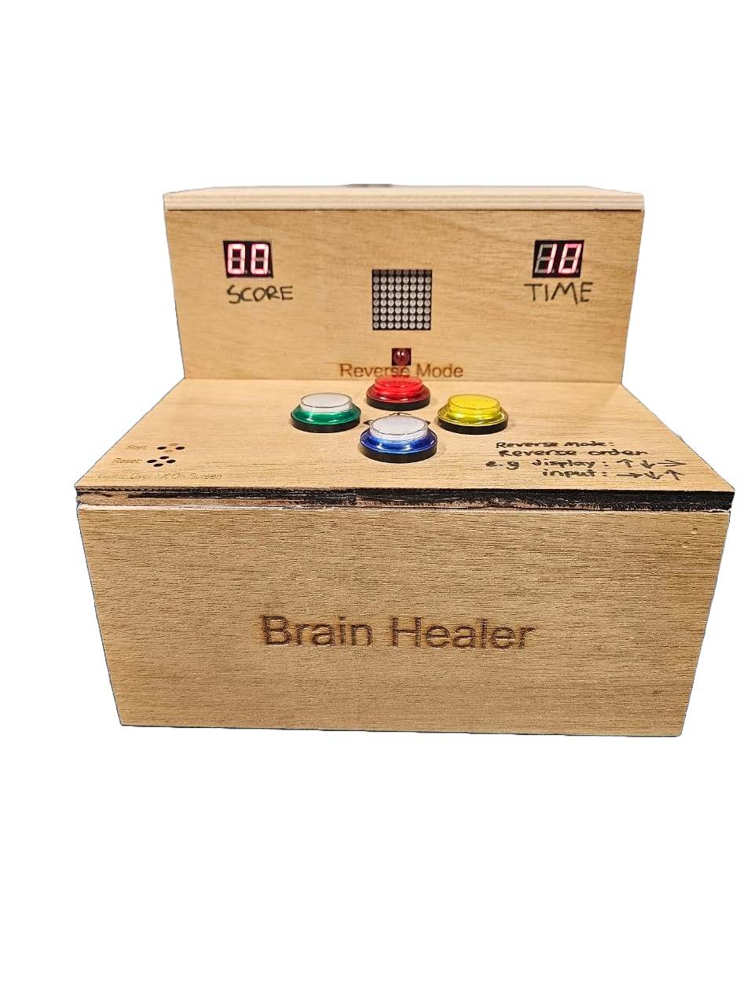

---

## Team Members

| Student ID | Name |
|---|---|
| 1008839 | Brandon Cheang |
| 1007154 | Song Joonhyung |
| 1008946 | Lim Jun Hui |
| 1008743 | Bryan Chua Bing Huan |
| 1008943 | Loo Jing Kai |
| 1008988 | Lee Chuan Yew Evan |
| 1008905 | Siddarth Reddy |

---

## Introduction

Brain Healers is a fast-paced, single-player memory challenge where players must recall and reproduce increasingly complex sequences of directional arrows under time pressure to achieve the highest score possible.

**Game procedure:**

- A single player watches a sequence of arrows (Up, Down, Left, Right) displayed one at a time on an LED matrix
- The player must memorise the sequence and then accurately recreate it using four arcade buttons
- Each correct sequence earns 3 points and advances the player to the next level
- With every level, the sequence becomes longer and the time limit decreases, increasing difficulty
- A random Reverse Mode may activate, requiring the player to input the sequence backwards for 2 bonus points (5 points total for reverse)
- The game ends immediately if the player makes a mistake or runs out of time

---

## Game Design

### Description of the Game

**Players:** Single Player

**How to play:**

1. When the game starts, the LED matrix displays a sequence of directional arrows, one at a time, each shown briefly before blanking
2. The player must memorise the order of the arrows shown, then reproduce the sequence exactly using the four arcade buttons
3. If the player enters the correct sequence, they clear the level and earn 3 points. The next level begins immediately
4. Each subsequent level increases in difficulty as the sequence grows by one additional arrow
5. If the player presses the wrong button at any point, the game ends immediately, and the player's final score is displayed on the 7-segment display

**Winning condition:** There is no fixed winning condition — the objective is to survive as many levels as possible and achieve the highest score.

### Unique Modification — Reverse Mode

To add originality beyond a straightforward sequence memory game, we introduce **Reverse Mode**. At the start of each level, it randomly determines whether that level is played in Reverse Mode. When active, the red LED lights up, and the player must enter the displayed sequence in reverse order. Completing a Reverse Mode level awards **5 points** instead of 3.

This mechanic is entirely random per level, so the player cannot anticipate it in advance and must adapt on the fly, introducing a meaningful risk-reward element that distinguishes Brain Healer from the original Human Benchmark game.

### User Manual

- Press the left and right buttons (green and yellow buttons) together to start the game
- Use the buttons to provide input matching the instructions shown on the LED. You have **10 seconds** after the display of the last instruction
- Clear as many levels as possible to attain higher scores
- If the reverse mode LED is on, input the buttons in reverse order to score the points
- Press all 4 buttons to reset the game after it is over
- Press the left and right buttons at the same time to start a new game

> *If start button is pressed without resetting after game over, practice mode starts without resetting score value, and resumes the current sequence level (intentional)*

### UI & UX

The enclosure is constructed from **plywood panels** assembled with glue.

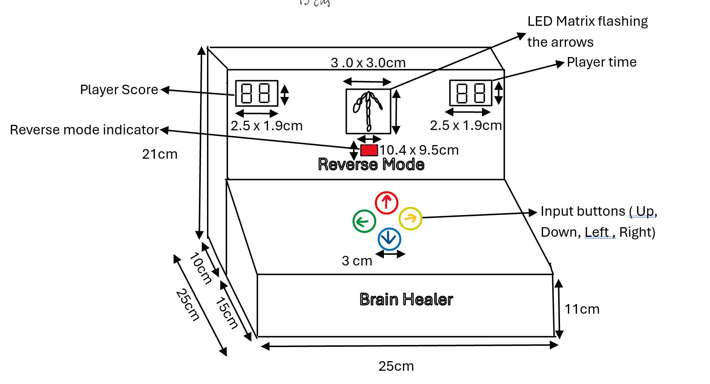

**Dimensions:**

| Element | Size |
|---|---|
| Overall enclosure | 25 × 25 × 21 cm (W × D × H) |
| LED matrix display window | 3.0 × 3.0 cm |
| 7-segment displays | 2.5 × 1.9 cm each |
| Reverse mode indicator | 10.4 × 9.5 cm area |
| Front panel slope height | 11 cm |

**CAD drawings (custom-cut wood panels):**

Button plate (with arcade button holes) and back plate:

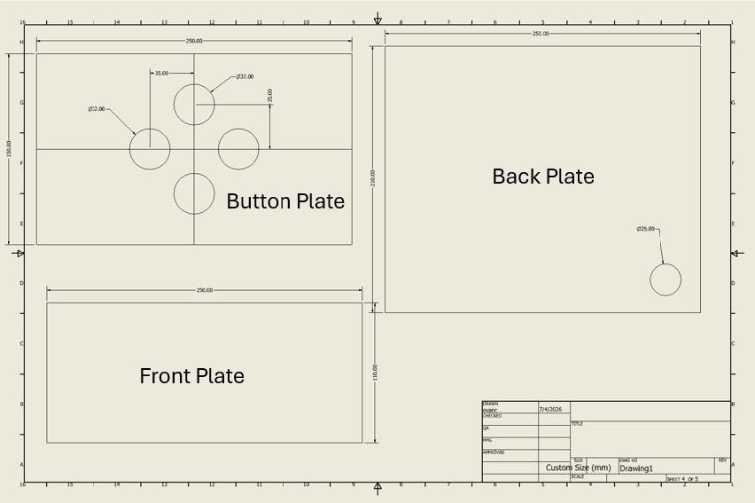

Base plate and side plate:

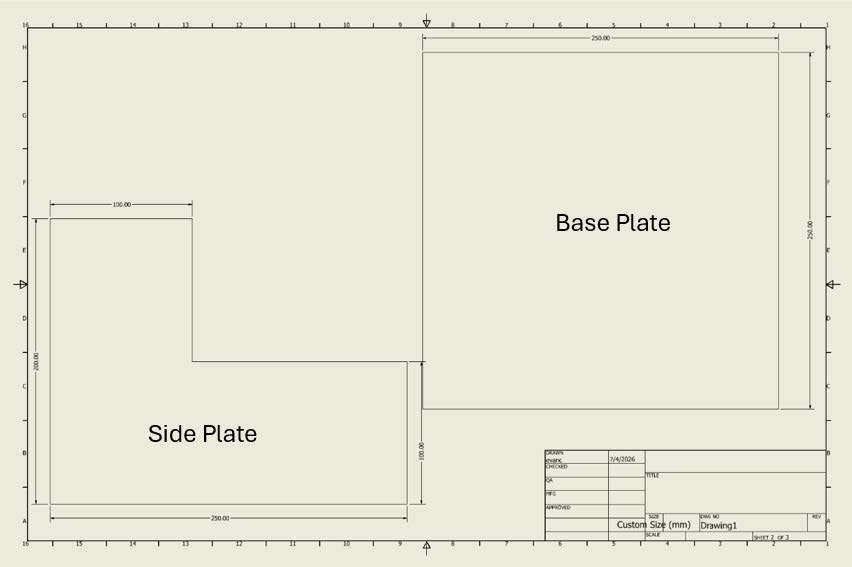

Top plate, display plate (with cutouts for 7-seg displays + LED matrix), and second side plate:

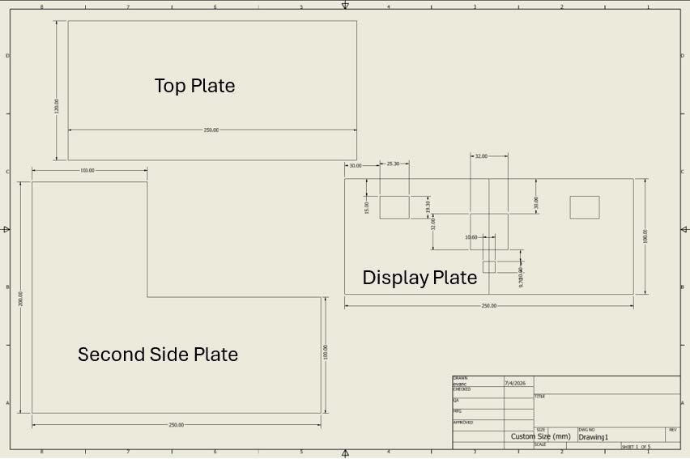

### Design Inspirations

Brain Healer draws its inspiration from the **Sequence Memory Test on Human Benchmark**, a popular cognitive test where players memorise and recall a growing sequence of highlighted tiles.

We adapted this concept for a physical hardware interface, replacing the screen-based tiles with directional arrow patterns on an LED matrix and four arcade buttons, making the experience more tactile and engaging. Unlike the original, which only tests pure memory, Brain Healer introduces a **Reverse Mode** mechanic that adds a layer of strategic difficulty unique to our implementation.

### Project Timeline

| Week | Tasks |
|---|---|
| Week 9 | Collect all components. Divide team into software (FSM + datapath in Lucid) and hardware (soldering + enclosure construction). Begin FPGA prototype on breadboard. |
| Week 10 | Continue prototyping. Software team integrates FSM with datapath and tests on FPGA. Hardware team completes soldering and enclosure assembly. Joint debugging. |
| Week 11 | Split team into three workstreams — poster, video, and final product polish + bug fixing. |
| Week 12 | Finalise and integrate all deliverables. Touch up poster, video, and writeup. Complete final product testing. |

### Pin Usage

**Output Pins:**

| Component | Direct Drive | Multiplexed |
|---|---|---|
| MAX7219 dot matrix | 5 | 5 |
| 2× 2-digit 7-seg | 18 | 11 |
| Red LED | 2 | 2 |
| Arcade button LEDs + signals | 16 | 10 |
| **Total** | **28** | **20** |

**Input Pins:** 4 input connections to the Br Board (one signal pin per arcade button)

### Soldering & Assembly Summary

| Task | Joints | Notes |
|---|---|---|
| Arcade buttons (signals + LED) | ~16 | 4 pins each. GND legs in series back to Br GND, Power legs in series back to Br 3.3V |
| 7-seg segment lines (shared) | ~14 | 7 wires bridged across 2 displays. Current-limiting resistor between each segment line and FPGA pin |
| 7-seg selector pins | 4 | One per digit |
| MAX7219 module | 5 | VCC, GND, DIN, CLK, CS |
| Red LED + resistor | 2 | Resistor in series between VCC and LED anode |
| **Total** | **~41** | |

**Perf board — soldering of arcade buttons**
*Green = Signal (LED) · Blue = Signal (Btn) · Red = Voltage · Black = Ground*

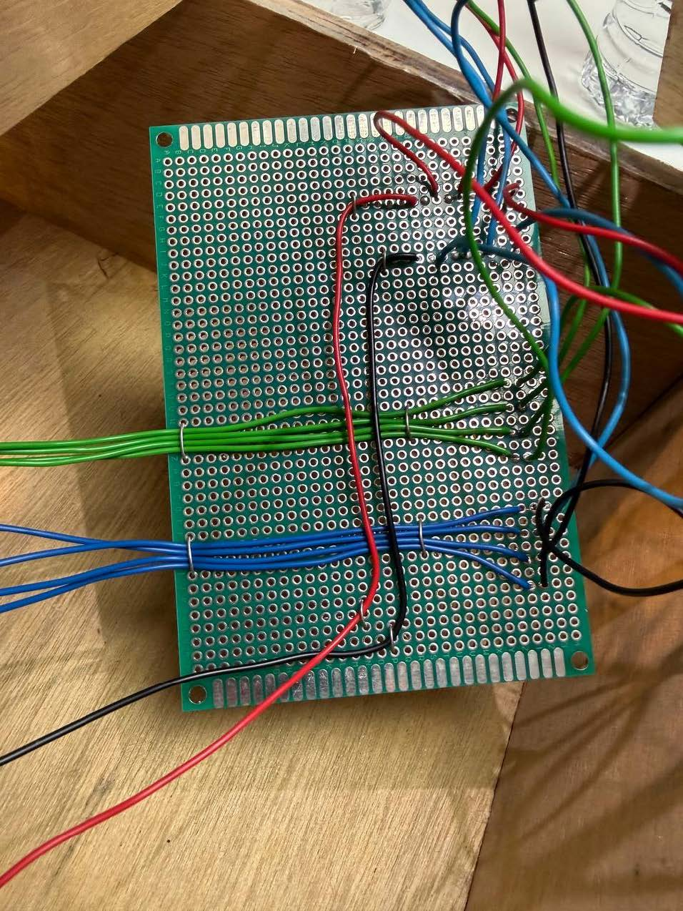

**Breadboarding — 7-segment displays + red LED with current-limiting resistors**

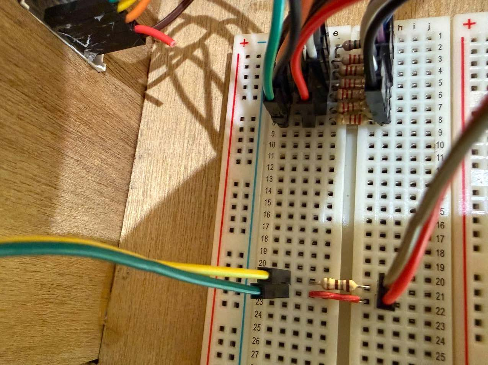

---

## Electronic Design

### Input/Output

**Inputs:**

- 4 × 30mm Arcade Buttons (Up, Down, Left, Right)

**Outputs:**

- 2 × 2-digit 7-segment displays (0.56" red): Player score and player time remaining
- 1 × 10mm red LED: Reverse Mode indication
- 1 × 8×8 Dot Matrix LED Display Module (MAX7219): Displays directional arrow patterns

### Datapath

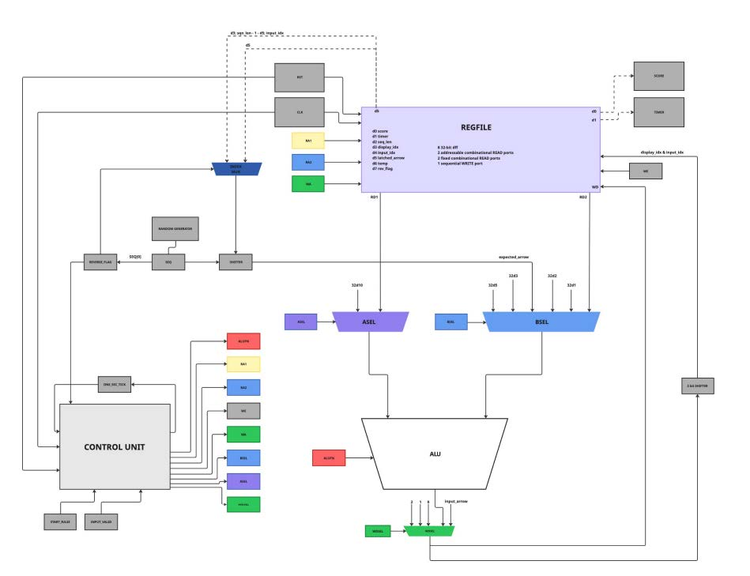

The datapath consists of:

- A register file
- A sequence register
- A reverse flag register
- An ALU
- Multiple multiplexers (ASEL, BSEL, write mux)
- Combinational logic blocks for arrow extraction and index calculation

🔗 **High-res datapath:** [Miro Board](https://miro.com/app/board/uXjVGtIC5-o=/?moveToWidget=3458764667759788518&cot=14)

#### 1. Register File

| Address (wa) | Name | Purpose |
|---|---|---|
| `d0` | score | Player score |
| `d1` | timer | Countdown timer |
| `d2` | seq_len | Current sequence length |
| `d3` | display_idx | Index for sequence display |
| `d4` | input_idx | Index for player input |
| `d5` | latched_arrow | Stores last player input |

#### 2. Sequence Register

`SEQ[30]` stores the full arrow sequence (packed 2-bit arrows)

#### 3. Reverse Flag Register

Determines whether input checking is forward or reverse

#### 4. ALU

The ALU is used for arithmetic operations.

**Supported operations:**

| Operation | Use |
|---|---|
| `ADD` | Increment indices, update score |
| `SUB` | Decrement timer |
| `PASS` | Load constants (e.g. timer = 10) |
| `MOD` | Extending timer value to 10 decimal (e.g. 1 → 01) |

**ALU Inputs:**

- **ASEL (ALU A input):** constant (10), RD1
- **BSEL (ALU B input):** RD2, constants (1, 2, 3, 5), expected_arrow

**ALU Output:** `alu.out`

#### 5. Key Control Signals

**Register Control:** `we`, `wa`, `data`

**ALU Control:** `alufn`, `asel`, `bsel`

**Game Control:** `seq_load`, `display_mode`, `show_phase_out`, `in_wait_input`

#### 6. Arrow Extraction Logic (Combinational Block)

Used instead of shifters in ALU for logic efficiency and faster computation:

```
arrow = (seq >> shift) & 2b11
```

#### 7. Index Selection Multiplexer

A multiplexer selects between normal and reverse index based on reverse flag value:

```
normal_idx  = input_idx
reverse_idx = seq_len - 1 - input_idx
```

#### 8. Write Back Path

```
if (input_valid):
    write input_arrow → latched_arrow (R5)
else:
    write ALU result → selected register
```

#### 9. Key Design Characteristics

- Minimal register usage (6 registers + 2 dedicated registers)
- Multiplexer-based flexible datapath
- Separation of control and datapath
- Efficient bit-level extraction instead of memory arrays
- Direct combinational comparison

### FSM

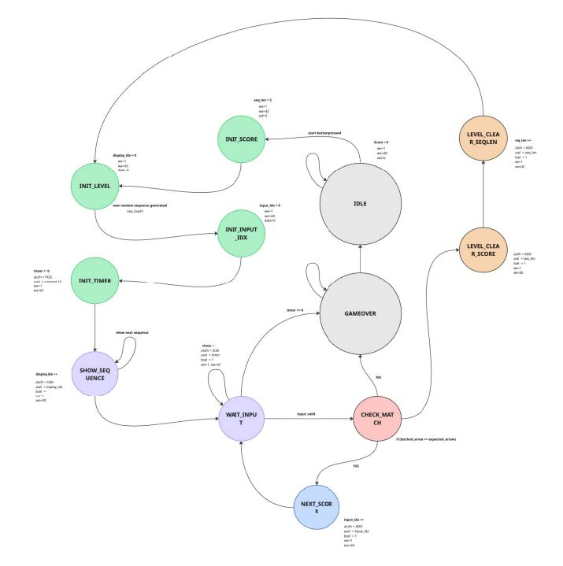

🔗 **High-res FSM:** [Miro Board](https://miro.com/app/board/uXjVGtIC5-o=/?moveToWidget=3458764667672662385&cot=14)

**12 states total:** IDLE, INIT_SCORE, INIT_LEVEL, INIT_INPUT_IDX, INIT_TIMER, SHOW_SEQUENCE, WAIT_INPUT, CHECK_MATCH, NEXT_ARROW, LEVEL_CLEAR_SCORE, LEVEL_CLEAR_SEQLEN, GAME_OVER

---

## Budget

| Component | Cost (SGD) |
|---|---|
| Jumper Wires | $11 |
| 8×8 Matrix | $11 |
| 4 × Arcade Button | $16 |
| 2 × 10mm RED LED | $1 |
| 4 × 2-Digit Seven Segment | $8 |
| **Total** | **$47** |

---

## 2D — Hardware Optimisation

To improve the efficiency, responsiveness, and overall resource utilisation of our FPGA-based system, we implemented several optimisations in both data structure design and hardware architecture.

### Datapath-Centric Design with Combinational Blocks

Arithmetic operations are routed through the ALU. This includes incrementing indices, updating timers, and initialising registers. By centralising computations within the ALU, redundant logic blocks are eliminated and hardware reuse is maximised.

On the other hand, using specific combinational logic blocks for shifting and reverse mode indexing — instead of ALU shift — enhances efficiency and improves execution speed.

> Overall, balancing usage of ALU (modular design) and combinational block logic (logical efficiency).

### FSM State Minimisation

The FSM went through three iterations: from over 30 states in Iteration 1, to a refined version in Iteration 2, and finally a minimised **12-state** final design.

**Iteration 1 — initial design with 30+ states (every operation as a separate state):**

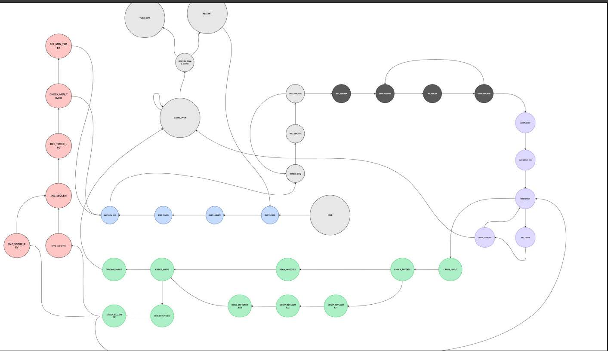

**Iteration 2 — refined intermediate design:**

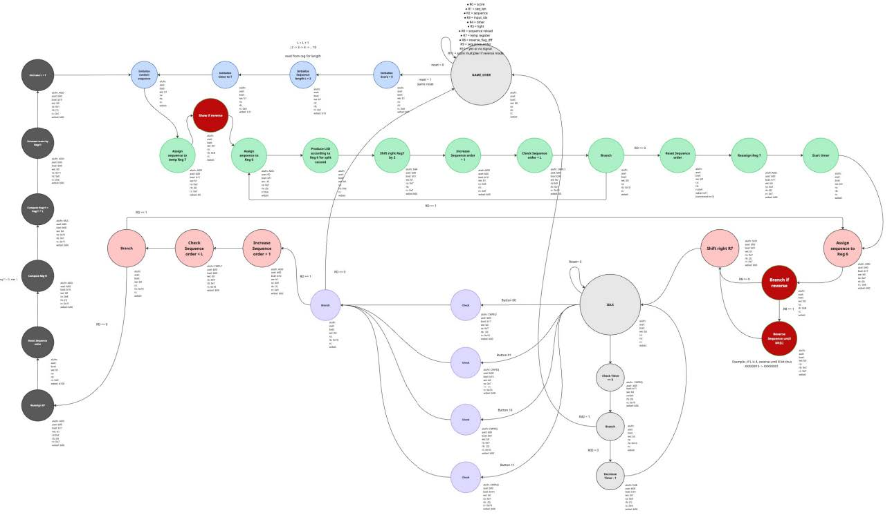

**Final — 12 states:**


**FSM minimization process:**

| Original | Optimized |
|---|---|
| 10 states for sequence display (shift reg per arrow) | 1 `SHOW_SEQUENCE` state with internal `show_timer[27]` |
| 4 separate Check states per button | 1 `CHECK_MATCH` with `input_valid` signal |
| 3 states for timer (check / branch / decrement) | Inline condition inside `WAIT_INPUT` |
| Dedicated reverse states | Combinational `exp_shift` using `rev_flag` |
| ALU comparisons causing combinational loops | Direct Lucid operators for comparisons; ALU for arithmetic only |

### Multiplexing for 7-Segment Displays

To reduce the number of required output pins, time-division multiplexing is used for the 7-segment displays. All digits share the same 8 segment lines, while 4 selector pins activate each digit sequentially. This reduces the total number of output pins required **from 18 to 11**. The multiplexing operates at ~1kHz so all digits appear continuously lit to the human eye.

### Separation of Datapath and Control

The system is designed with a clear separation between the datapath and the control unit (FSM). The FSM is responsible only for generating control signals, while the datapath performs all computations and data storage operations. This modular design improves clarity, allows each component to be optimised independently, and aligns with standard processor design principles.

### Direct Hardware Feedback for Real-Time Decisions

Implementation of if-branching is fed directly back to the FSM for immediate decision-making. This eliminates the need for additional registers to store intermediate comparison results. As a result, the system can make branching decisions within the same clock cycle.

### Enhanced Game Features

**Reverse Gamemode:** A random gamemode requiring users to input the sequence reversed, with 5 points instead of 3.

**UI / UX Enhancements:**

- Bright red lights on the LED panels and 7-segment display
- Buttons designed to be within reach of one hand
- Smaller buttons used so input does not require a hard press

### Backend Improvements

**Arcade Buttons:**

- Soldered on perf board
- VCC and GND legs multiplexed across all 4 buttons (connected in series)
- Colour-coded wires for consistency

**LED / 7-Segment:**

- Use breadboard with jumper wires instead of soldering directly
- Breadboard rows labelled A–G matching standard 7-segment naming conventions
- Multiplex all 4 7-segments + 1 resistor per segment

**LED Matrix:**

- Use jumper wire with pre-built display driver module

**Alchitry Br:**

- Use separate Br banks for the LED matrix, buttons, and 7-segment displays

### Wiring improvement — before vs after

**Before (messy):**

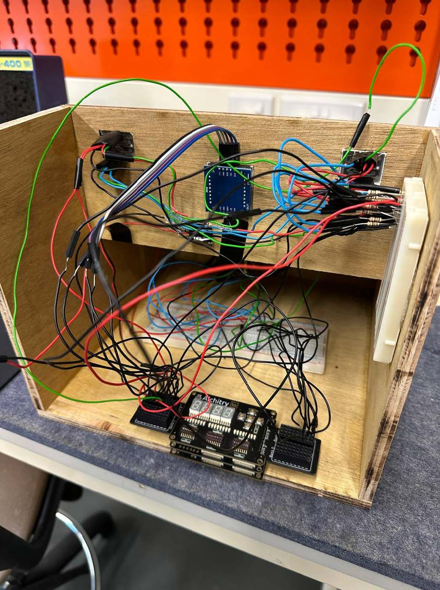

**After (cleaned up):**

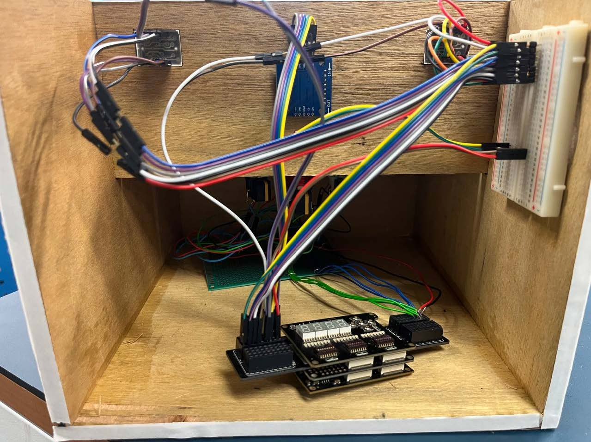

Replacing tangled soldered wires with colour-coded jumper wires and consolidating connections via the perf board significantly improved both maintainability and signal reliability.

---

## Sustainability and Inclusivity

Our project aligns with **UN SDG 12 (Responsible Consumption and Production)** and **UN SDG 3 (Good Health and Well-Being)**.

### Energy Efficiency

- **Single ALU with combinational blocks:** Reduces switching activity within the FPGA
- **Minimal-state FSM:** Fewer operations per game cycle
- **Time-division multiplexing for 7-segment displays:** Reduces active output drivers
- **Conditional output activation:** LEDs only on when needed
- **Event-driven operation:** Button presses and timer events trigger state transitions
- **MAX7219 LED driver:** SPI communication (3 pins) instead of directly driving each LED

### Environmental Impact and Resource Efficiency

We used **recycled wood** sourced from the recycling area instead of purchasing new raw materials. We considered 3D printing with PLA plastic, but PLA printing risks misprints and reprints, and end-of-life PLA requires industrial processes to recycle. Recycled wood is more accessible and has a lower end-of-life impact.

### Further Upgradability / Modularity

While most enclosure panels are permanently glued, selected panels use tape for removability, allowing easy access to internal components for replacements and future upgrades.

### Repurposing / End-of-Life Considerations

Electrical components can be desoldered and repurposed, reducing electronic waste. Wood panels can be recycled or repurposed.

### Inclusivity

- **Portable design:** Compact and lightweight
- **Clear interface:** Large LED buttons and displays with clear visual output
- **Simple gameplay:** Memory and pattern recognition mechanics help younger users develop cognitive skills and older users maintain brain function

---

## Summary

### Conclusion

Brain Healer integrates digital logic design with an engaging and interactive experience. By implementing hardware into a traditional memory sequencing game, we showcase how concepts such as FSM design and datapath architecture can be used in a practical, real-world application.

Additional features like Reverse Mode allow Brain Healer to stand out by enhancing gameplay through increased unpredictability and difficulty. Overall, we believe our project has met its intended functional, design and sustainability goals.

### Lessons Learned

**Technical lessons:**

- Hardware constraints like pin limitations
- Multiplexing of 7-segment displays
- Efficient use of communication protocols like SPI for the LED matrix
- Practical skills: soldering, wiring, and fabricating the enclosure
- Effective task delegation under tight deadlines
- Managing trade-offs between complexity and feasibility

**What went well:**

- Clear modular separation of FSM and datapath enabled systematic debugging
- Multiplexing and SPI significantly reduced pin usage

**Areas for improvement:**

- Hardware debugging during early prototyping — solved by replacing soldered wires with jumper wires

### Overall Experience

Our experience was challenging yet rewarding. We navigated software integration, applied key concepts, and faced unfamiliar fabrication processes — strengthening our teamwork and problem-solving skills.

---

## Appendix

### 1. ALU Design and Tests

**Design:**

- Implemented as a dedicated module rather than inside the top-level file
- All major ALU components modularized into separate files: adder, compare, boolean, shifter, multiplier
- Follows the Lab 3 ALUFN-based organization

**Testing:**

- Manual testing via `manual_tester_fsm`, DIP switch inputs, and LED result display
- Automated self-testing via `simple_fsm` and `tester_alu` for 31 different cases
- Current test case index displayed on LEDs
- Expected and actual values viewable through `result_viewer`
- Error cases can be demonstrated deliberately using `error_pin`

### 2. Prototype Code + Repo Link

🔗 **GitHub:** https://github.com/50002-computation-structures/Group13

### 3. Project Management Log — Team Tasks

| Module | Member |
|---|---|
| adder | Bryan |
| boolean | Brandon |
| compare | Jun Hui |
| shifter | Jing Kai |
| multiplier | Evan |
| manual top | Sid |
| automated top | Charlie |

### 4. Components' Specifications

| Component | Source |
|---|---|
| 30mm Illuminated Arcade Push Button | Shopee |
| 0.56" 2-Digit 7-Segment LED Display (Common Anode, Red) | Shopee |
| 10mm Red LED | Shopee |
| MAX7219 8×8 LED Dot Matrix Display Module | Shopee |

---

## Build Information

```
Tools:    Alchitry Labs 2, Vivado (Xilinx Artix-7)
Language: Lucid HDL
Board:    Alchitry Au + IO Shield (100MHz)
Timing:   WNS = -3.577ns (functional at 100MHz)
```
